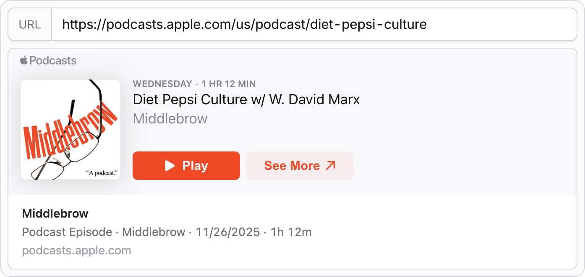

# Statamic Embed Fieldtype

Fieldtype for embedding and previewing external content.



## Features

- Augment URLs with embed data: iframe, thumbnail, metadata
- Supports any provider with oEmbed endpoint or Open Graph meta tags
- Live preview in the control panel

## Installation

Install the addon via Composer:

```bash
composer require daun/statamic-embed-fieldtype
```

## Fieldtype

The addon ships with an `embed` fieldtype that accepts a url and shows a preview in the editor.

```yaml
fields:
  -
    handle: embed
    field:
      type: embed
      display: Embed
```

## Frontend

The fieldtype augments the url to an array of embed data. The following example
will render a simple embed card with either an iframe (if available) or a preview
image.

```html
{{ if embed:url }}
  <article class="border rounded-lg overflow-hidden">
    {{ if embed:code }}
      <div
        class="relative aspect-(--embed-ratio) overflow-hidden [&_iframe]:w-full [&_iframe]:h-full [&_iframe]:border-0"
        style="--embed-ratio: {{ embed:code:ratio }}"
      >
        {{ embed:code:html }}
      </div>
    {{ elseif embed:image }}
      
    {{ /if }}
    {{ if embed:title }}
      <div class="p-4">
        <p class="line-clamp-1 font-semibold">
            <a href="{{ embed:url }}">{{ embed:title }}</a>
        </p>
        {{ if embed:description || embed:author:name }}
          <p class="line-clamp-1">{{ embed:description ?? embed:author:name }}</p>
        {{ /if }}
        {{ if embed:provider:url }}
          <p class="text-gray-500">{{ embed:provider:url | replace('https://', '') }}</p>
        {{ /if }}
      </div>
    {{ /if }}
  </article>
{{ /if }}
```

### Unaugmented URL

If you want to use the raw url without augmentation, you can access it via `embed:url`. To turn off
augmentation completely, you can set the field config `augment_to_embed_data` to `false`. This will
return the url as-is in all frontend contexts.

```diff
fields:
  -
    handle: embed
    field:
      type: embed
      display: Embed
+     augment_to_embed_data: false
```

## Extending the Embed Library

The addon uses the [Embed](https://github.com/php-embed/Embed) library under the hood, which supports
a variety of providers out of the box: YouTube, Vimeo, Instagram, Flickr, etc. You can customize the
library instance and settings and also create custom adapters for unsupported providers by registering
a resolving callback in your service provider. See [Extending Embed](https://github.com/php-embed/Embed?tab=readme-ov-file#extending-embed)
for details and examples.

```php
namespace App\Providers;

use Embed\Embed;

class AppServiceProvider extends ServiceProvider
{
    public function register()
    {
        $this->app->afterResolving(Embed::class, function (Embed $embed) {
            $embed->getExtractorFactory()->addAdapter('mysite.com', MySite::class);
            $embed->setSettings([
                'instagram:token' => '12345678',
                'twitter:token' => 'abcdefgh',
            ]);
        });
    }
}
```

## License

[MIT](https://opensource.org/licenses/MIT)
